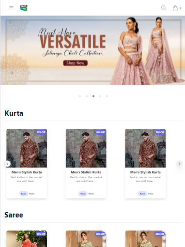
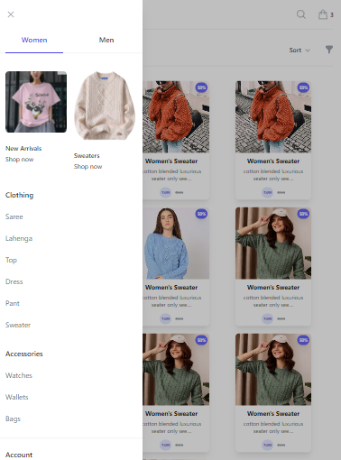

# OfferZone E-Commerce Application
               

# Overview

OfferZone is a full-stack e-commerce platform developed using Java, Spring Boot, MySQL, React, and Docker. The application includes robust features such as advanced product filtering, user authentication, order tracking, payment gateway integration, and an admin panel to manage categories and orders. Despite my attempts to deploy the Dockerized version, the large image size exceeded platform limitations, so I’m showcasing the project through GitHub.

# Tech Stack

Frontend: 
        React, Redux, Material UI, Tailwind CSS

Backend: 
        Java, Spring Boot, Spring Security, JPA, MySQL

Database: 
        MySQL (FreeSQLDatabase.com)

State Management: 
        Redux

Containerization:
        Docker

Security: 
        JWT-based authentication using Spring Security

# Key Features

1. User Authentication
         Spring Security: Implemented JWT-based user authentication.
         Role-based Access: Differentiates between user and admin roles, ensuring secure access to the platform.

        

2. Product Pages with Advanced Filters
          Users can browse products with multi-criteria filters, including categories, size, price range, and brands.
          Dynamic Filtering: Supports multiple simultaneous filters for a refined user experience.

3. Cart Functionality
          Users can add and remove items from the cart, adjust quantities, and proceed to checkout.
          State Management: Redux handles cart state management for a seamless user experience across components.

4. Search Mechanism
          Implemented search functionality that dynamically retrieves products from the database based on user input.

5. Order Tracking and Payment Gateway
          Users can track their orders and view past purchases.
          Integrated a payment gateway for secure transaction handling (mocked for demonstration purposes).

6. Admin Panel
          Category Management: Admins can create, edit, and remove product categories.
          Order Management: Admins can view all orders and update order statuses dynamically from the admin dashboard.

7. Responsive UI
          Built using Material UI and Tailwind CSS for a modern, responsive, and user-friendly interface.
          Project Structure

Frontend: React application structured with components, state managed by Redux for scalability.

Backend: Spring Boot REST API for product management, user authentication, and order tracking.

Database: MySQL database for storing product, user, and order data.

Docker Setup (Attempted)
          The project was Dockerized with a multi-stage build, using a slimmed-down JRE to reduce image size. However, the final image size still exceeded 500 MB, preventing deployment             on certain free hosting platforms.

bash
Copy code
# Build Docker image
docker build -t offerzone .

# Run Docker container
docker run -p 8080:8080 offerzone

Challenges Faced
Docker Deployment: The Docker image size (856 MB) was too large for deployment on free-tier platforms due to dependencies.

Installation Guide

Prerequisites
Java (JDK 8 or higher)
Maven (for backend build)
Node.js (for frontend)
MySQL database

Clone the repository:
bash
Copy code
git clone https://github.com/your-username/offerzone.git
cd offerzone
Backend Setup:
Database Configuration: Update the application.properties with your database credentials.
Build the backend:
bash
Copy code
cd offerzone-backend
mvn clean install
mvn spring-boot:run
Frontend Setup:
Install dependencies:
bash
Copy code
cd offerzone-frontend
npm install
npm start

Future Improvements
Optimize Docker Image: Further reduce the Docker image size for deployment.
Enhanced Admin Features: Add bulk upload for products and more advanced analytics.
Feel free to adjust or add any additional details as per your project specifics!

# Getting Started with Create React App

This project was bootstrapped with [Create React App](https://github.com/facebook/create-react-app).

## Available Scripts

In the project directory, you can run:

### `npm start`

Runs the app in the development mode.\
Open [http://localhost:3000](http://localhost:3000) to view it in your browser.

The page will reload when you make changes.\
You may also see any lint errors in the console.

### `npm test`

Launches the test runner in the interactive watch mode.\
See the section about [running tests](https://facebook.github.io/create-react-app/docs/running-tests) for more information.

### `npm run build`

Builds the app for production to the `build` folder.\
It correctly bundles React in production mode and optimizes the build for the best performance.

The build is minified and the filenames include the hashes.\
Your app is ready to be deployed!

See the section about [deployment](https://facebook.github.io/create-react-app/docs/deployment) for more information.

### `npm run eject`

**Note: this is a one-way operation. Once you `eject`, you can't go back!**

If you aren't satisfied with the build tool and configuration choices, you can `eject` at any time. This command will remove the single build dependency from your project.

Instead, it will copy all the configuration files and the transitive dependencies (webpack, Babel, ESLint, etc) right into your project so you have full control over them. All of the commands except `eject` will still work, but they will point to the copied scripts so you can tweak them. At this point you're on your own.

You don't have to ever use `eject`. The curated feature set is suitable for small and middle deployments, and you shouldn't feel obligated to use this feature. However we understand that this tool wouldn't be useful if you couldn't customize it when you are ready for it.

## Learn More

You can learn more in the [Create React App documentation](https://facebook.github.io/create-react-app/docs/getting-started).

To learn React, check out the [React documentation](https://reactjs.org/).

### Code Splitting

This section has moved here: [https://facebook.github.io/create-react-app/docs/code-splitting](https://facebook.github.io/create-react-app/docs/code-splitting)

### Analyzing the Bundle Size

This section has moved here: [https://facebook.github.io/create-react-app/docs/analyzing-the-bundle-size](https://facebook.github.io/create-react-app/docs/analyzing-the-bundle-size)

### Making a Progressive Web App

This section has moved here: [https://facebook.github.io/create-react-app/docs/making-a-progressive-web-app](https://facebook.github.io/create-react-app/docs/making-a-progressive-web-app)

### Advanced Configuration

This section has moved here: [https://facebook.github.io/create-react-app/docs/advanced-configuration](https://facebook.github.io/create-react-app/docs/advanced-configuration)

### Deployment

This section has moved here: [https://facebook.github.io/create-react-app/docs/deployment](https://facebook.github.io/create-react-app/docs/deployment)

### `npm run build` fails to minify

This section has moved here: [https://facebook.github.io/create-react-app/docs/troubleshooting#npm-run-build-fails-to-minify](https://facebook.github.io/create-react-app/docs/troubleshooting#npm-run-build-fails-to-minify)
